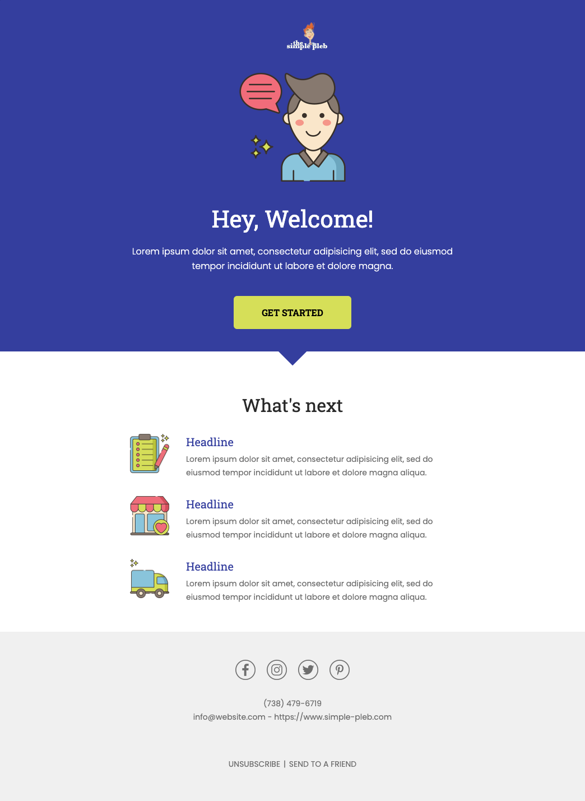

# laravel-mails
Laravel (Blade) Email Templates For membership and ecommerce sites.

- [Welcome Email](#welcomeEmail)

## How to Use

* Copy files and folders to the same structure within your Laravel application.

```bash
    /config/pleb.php 
    /resources/views/email/*
    /resources/lang/en/pleb.php
    /public/assets/img/email/*
    /app/Mail/*
```

* Edit the values in ``` config/pleb.php ``` and ``` /resources/lang/en/pleb.php ``` 

    **Note:** You only change the right-side values not the left-side variables

* Make sure your ```/config/mail.php``` file has been updated to set the global from address etc.
```php
    'from' => [
        'address' => env('MAIL_FROM_ADDRESS', 'hello@example.com'),
        'name' => env('MAIL_FROM_NAME', 'Example'),
    ],
```

## Sending Welcome Message
From your controller simply call the mailable as you normally would. You can also send some optional
variables as an array.


```php
    use App\User;
    use App\Mail\WelcomeMember;

    $options = array(
        'unsubscribe_url'   => 'http://mysite.com/unsub',
        'play_url'          => 'http://google-play.com/myapp',
        'ios_url'           => 'http://apple-store.com/myapp',
        'sendfriend_url'    => 'http://mysite.com/send_friend',
        'webview_url'       => 'http://mysite.com/webview_url',
    );


    $user = User:find(1);
    Mail::to($user)->send(new WelcomeMember($user, $options));
```

## Previewing these emails
If you would like to preview the emails before using them, copy the contents of the 
```/routes/web.php``` to your version. Remember to remove these routes before launching your application.

```php
    Route::get('welcome_member', function () {
    
        $member = App\User::find(1);
        return new App\Mail\WelcomeMember($member);
    });
```

## Screen Shots

<a name="welcomeEmail"></a>



